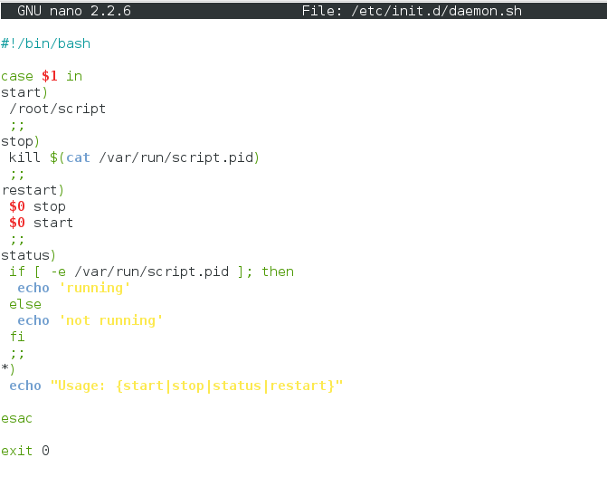
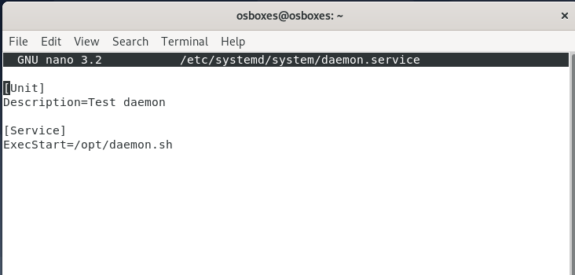
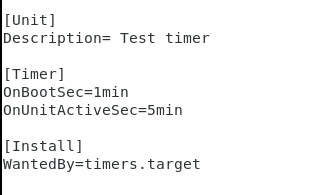

Вопросы:
1. Назовите основные отличия и преимущества systemd от sysvinit, опишите подходы  
   - sysvinit запускает процессы последовательно исходя из фазы загрузки, а systemd сначала исполняет default.target, а затем строит дерево зависимостей
   - systemd поддерживает активацию сервисов на основе сокетов
   - Systemd нет runlevel, но есть targets, определяющие зависимости одних юнитов от других
2. Каким образом происходит параллельный запуск всех процессов но в то же время сервисы стартуют с нужными зависимостями друг относительно друга  
- systemd по построенному дереву зависимостей понимает необходимые для запуска демона сервисы и запускает их параллельно. Также systemd позволяет заранее создать сокет для сервиса
3. каким образом проверить работает процесс в sysvinit и в systemd?  
- sysvinit:
  chkconfig service_name или service --status-all  
 - systemd: systemctl status unit  
4. Как добавить в автозагрузку init скрипт в sysvinit и в systemd?  
  Sysvinit: Добавить скрипт в директорию /etc/init.d  
```
chkconfig srvice_name on
```
Systemd: Добавить файл с описанием модуля в /etc/systemd/system/  
```
sysctemctl enable service
```
5. Как посмотреть логи в системе systemd по нужному нам процесс  
```
 journalctl -u <unit_name>  
```
Задачи:  
1. написать простой скрипт на любом языке программирования который будет работать в режиме демона  
  ```bash
 #!/bin/bash
 while :
 do
   echo 'test deam' > /var/logging_test.log
   sleep 1m
 done
 ```
2. установить дистрибутив Debian 8 и написать sysvnit скрипт для запуска процесса, добавить в автозагрузку, проверить автозагрузку и работу start stop аргументов

3. Установить Debian 10, написать systemd unit, ш в автозагрузку, проверить что скрипт запускается после рестарта, проверить start stop status unit-а

4. написать timer для systemd который раз в 5 минут пишет что-либо в лог файл

